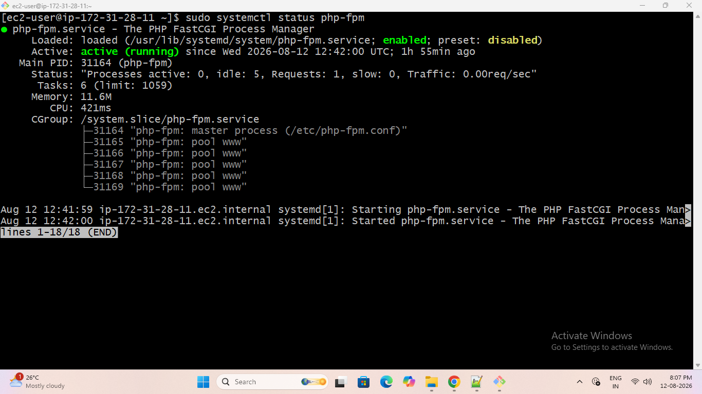
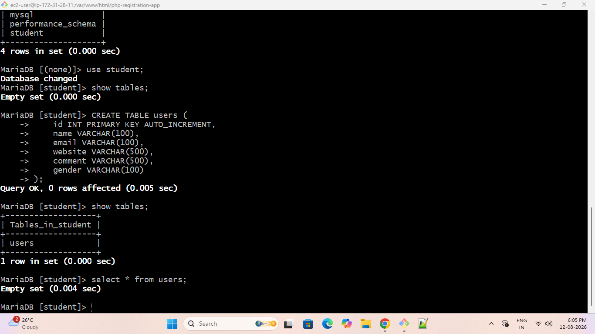
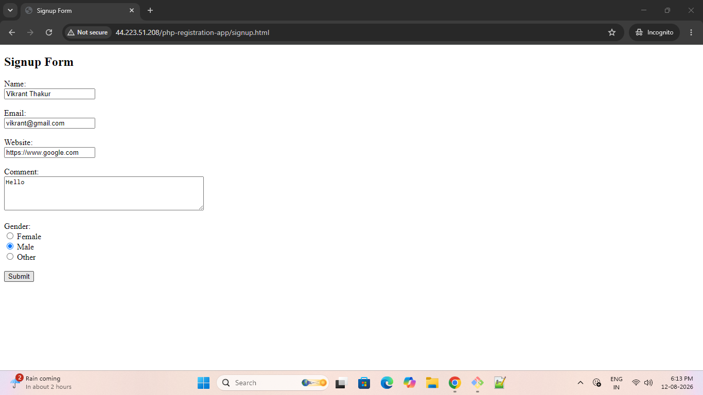
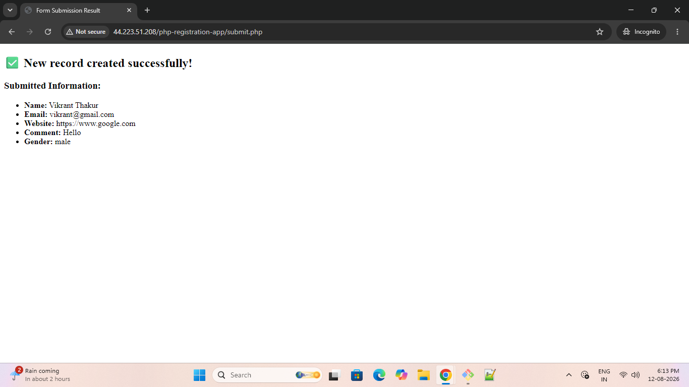
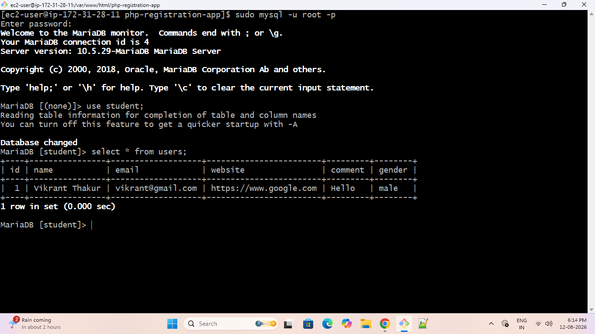
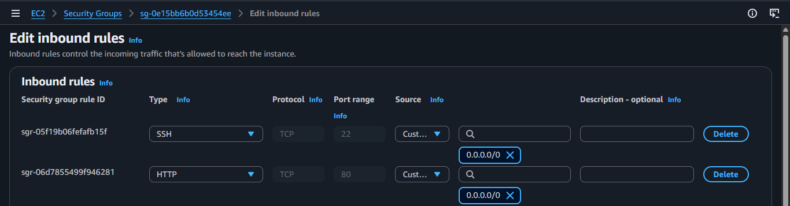

# PHP Registration App

A simple PHP and MySQL registration application deployed on an **AWS EC2 instance** using **Apache Web Server**.

This project demonstrates the complete process of deploying a PHP web application on AWS, configuring a Linux server, installing Apache/PHP/MariaDB, connecting the application with a database, and accessing the application through the EC2 public IP address.

---

## 📌 Project Overview

The PHP Registration App allows users to enter their registration details through a web form.

The application collects:

- Name
- Email
- Website
- Comment
- Gender

The submitted information is stored in a **MySQL/MariaDB database** running on the AWS EC2 instance.

### Application Flow

```text
User Browser
     |
     | HTTP Request
     ↓
AWS EC2 Instance
     |
     ├── Apache Web Server
     |
     ├── PHP
     |
     └── MariaDB / MySQL
             |
             ↓
        student Database
             |
             ↓
          users Table
```

---

# 🚀 Features

- User registration form
- PHP-based form processing
- MySQL/MariaDB database integration
- Stores submitted registration information
- Displays submitted information
- Apache web server
- Deployment on AWS EC2
- Linux server configuration
- GitHub-based application deployment

---

# 🛠️ Technologies Used

| Technology | Purpose |
|------------|---------|
| PHP | Backend/application logic |
| MySQL / MariaDB | Database |
| Apache | Web Server |
| AWS EC2 | Application hosting |
| Amazon Linux | Operating System |
| Git | Version Control |
| GitHub | Source Code Repository |
| Linux | Server Administration |

---

# 📁 Project Structure

```text
php-registration-app/
│
├── signup.html
├── submit.php
├── screenshots/
│   ├── security-group.png
│   ├── ec2-terminal.png
│   ├── mysql-database.png
│   ├── registration-page.png
│   ├── registration-success.png
│   ├── database-records.png
│
└── README.md
```

---

# ☁️ AWS Deployment

## Step 1: Launch EC2 Instance

Create an EC2 instance from the AWS Management Console.

### Configuration

- AMI: Amazon Linux
- Instance Type: Suitable free-tier/low-cost instance
- Key Pair: Required for SSH access
- Security Group: Allow SSH and HTTP traffic

### Required Security Group Rules

| Type | Protocol | Port | Purpose |
|------|----------|------|---------|
| SSH | TCP | 22 | Connect to EC2 using SSH |
| HTTP | TCP | 80 | Access web application |

---

# Step 2: Connect to EC2

Connect to the EC2 instance using SSH.

```bash
ssh -i your-key.pem ec2-user@<EC2-PUBLIC-IP>
```

Example:

```bash
ssh -i my-key.pem ec2-user@3.xx.xx.xx
```

---

# Step 3: Update Amazon Linux

```bash
sudo yum update -y
```

---

# Step 4: Install Required Packages

Install Apache, MariaDB, PHP and Git:

```bash
sudo yum install httpd mariadb105-server php git -y
```

# 🐘 Verify PHP Installation

Check the installed PHP version:

```bash
php --version
```

Install the PHP MySQL/MariaDB extension:

```bash
sudo yum install php8.5 press tab

sudo yum install php8.5-mysqlnd.x86_64 -y
```

### Installed Components

```text
Apache
PHP
PHP-MySQLnd
MariaDB
Git
```

---

# Step 5: Start Services

Start Apache:

```bash
sudo systemctl start httpd
```

Start MariaDB:

```bash
sudo systemctl start mariadb
```

Start PHP-FPM:

```bash
sudo systemctl start php-fpm
```

---

# Step 6: Enable Services at Boot

Enable the services so they automatically start after an EC2 reboot.

```bash
sudo systemctl enable httpd
sudo systemctl enable mariadb
sudo systemctl enable php-fpm
```

---

# Step 7: Check Service Status

Check Apache:

```bash
sudo systemctl status httpd
```

Check MariaDB:

```bash
sudo systemctl status mariadb
```

Check PHP-FPM:

```bash
sudo systemctl status php-fpm
```

All required services should show:

```text
active (running)
```

### EC2 Terminal



---

# 📦 Application Deployment

## Step 8: Navigate to Apache Web Root

Apache serves web application files from:

```bash
/var/www/html/
```

Navigate to the directory:

```bash
cd /var/www/html/
```

---

# Step 9: Clone the GitHub Repository

Clone the project from GitHub:

```bash
sudo git clone https://github.com/devvikrantthakur/php-registration-app.git
```

Check the directory:

```bash
ls
```

Navigate into the project:

```bash
cd php-registration-app
```

Check the project files:

```bash
ls
```

Expected files:

```text
signup.html
submit.php
README.md
```

---

# 🗄️ Database Configuration

## Step 10: Open MariaDB

```bash
sudo mysql
```

---

# Step 11: Set MariaDB Root Password

```sql
ALTER USER 'root'@'localhost' IDENTIFIED BY 'root';
```

Exit MariaDB:

```sql
exit;
```

---

# Step 12: Login to MariaDB

```bash
sudo mysql -u root -p
```

Enter the configured password when prompted.

---

# Step 13: Create Database

```sql
CREATE DATABASE student;
```

Check available databases:

```sql
SHOW DATABASES;
```

---

# Step 14: Select Database

```sql
USE student;
```

---

# Step 15: Create Users Table

```sql
CREATE TABLE users (
    id INT PRIMARY KEY AUTO_INCREMENT,
    name VARCHAR(100),
    email VARCHAR(100),
    website VARCHAR(500),
    comment VARCHAR(500),
    gender VARCHAR(100)
);
```

Check the table:

```sql
SHOW TABLES;
```

---

# Step 16: Check Database Records

```sql
SELECT * FROM users;
```

Initially, the table may be empty.

After a user submits the registration form, the submitted information will be stored in this table.

### MySQL / MariaDB Database



---

# 🔌 PHP Database Configuration

The PHP application connects to the database through `submit.php`.

Open the file:

```bash
sudo vim submit.php
```

Configure the database connection:

```php
$servername = "localhost";
$username = "root";
$password = "root";
$dbname = "student";
```

### Database Configuration

| Parameter | Value |
|-----------|-------|
| Server | localhost |
| Username | root |
| Database | student |
| Password | Configured MariaDB password |

Since MariaDB is running on the same EC2 instance, the application connects using:

```text
localhost
```

---

# 🔄 Restart Services

After installing PHP extensions or modifying configuration:

```bash
sudo systemctl restart httpd
sudo systemctl restart mariadb
sudo systemctl restart php-fpm
```

---

# 🌐 Access the Application

Find the **Public IPv4 Address** of the EC2 instance from the AWS EC2 Console.

Open the following URL in a web browser:

```text
http://<EC2-PUBLIC-IP>/php-registration-app/signup.html
```

Example:

```text
http://3.xx.xx.xx/php-registration-app/signup.html
```

> Replace `<EC2-PUBLIC-IP>` with the actual public IPv4 address of your EC2 instance.

### Registration Page



---

# 📝 Application Workflow

```text
1. User opens signup.html
           |
           ↓
2. User fills registration form
           |
           ↓
3. User clicks Submit
           |
           ↓
4. Form sends data to submit.php
           |
           ↓
5. PHP connects to MariaDB
           |
           ↓
6. Data is inserted into users table
           |
           ↓
7. Submitted information is displayed
```

### Successful Registration



### Database Records



---

# 🔐 Security Group Configuration

The EC2 Security Group allows the required network traffic.

```text
Inbound Rules:

SSH   → TCP → 22 → EC2 administration
HTTP  → TCP → 80 → Web application access
```

### Security Group



> For production environments, SSH access should be restricted to trusted IP addresses.

---

# 🔧 Useful Linux Commands

## Check Apache Status

```bash
sudo systemctl status httpd
```

## Start Apache

```bash
sudo systemctl start httpd
```

## Restart Apache

```bash
sudo systemctl restart httpd
```

## Check MariaDB Status

```bash
sudo systemctl status mariadb
```

## Check PHP Version

```bash
php --version
```

## Check Installed PHP Modules

```bash
php -m
```

## Check Apache Configuration

```bash
sudo apachectl configtest
```

## View Apache Error Logs

```bash
sudo tail -f /var/log/httpd/error_log
```

## Check Application Files

```bash
cd /var/www/html/php-registration-app
ls
```

---

# 🛠️ Troubleshooting

## Apache is not running

Check the status:

```bash
sudo systemctl status httpd
```

Start Apache:

```bash
sudo systemctl start httpd
```

---

## PHP code is not executing

Check PHP:

```bash
php --version
```

Restart Apache and PHP-FPM:

```bash
sudo systemctl restart httpd
sudo systemctl restart php-fpm
```

---

## Database connection error

Verify MariaDB:

```bash
sudo systemctl status mariadb
```

Login to MariaDB:

```bash
sudo mysql -u root -p
```

Then check:

```sql
SHOW DATABASES;
```

---

## Application cannot be accessed from browser

Check the following:

1. EC2 instance is running.
2. Apache is running.
3. Security Group allows HTTP Port 80.
4. Correct EC2 Public IPv4 address is being used.
5. Application exists under `/var/www/html/`.

Check Apache:

```bash
sudo systemctl status httpd
```

---

# 📊 Project Architecture

```text
                    Internet
                       |
                       |
                 HTTP - Port 80
                       |
                       ↓
              +----------------+
              |   AWS EC2      |
              |                |
              |  Amazon Linux  |
              |                |
              |    Apache      |
              |       |        |
              |      PHP       |
              |       |        |
              |   PHP-FPM      |
              |       |        |
              |    MariaDB     |
              |       |        |
              +-------|--------+
                      |
                      ↓
               student Database
                      |
                      ↓
                  users Table
```

---

# 🎯 Skills Demonstrated

This project demonstrates practical experience with:

- AWS EC2
- EC2 Security Groups
- Linux server administration
- SSH
- Apache Web Server
- PHP deployment
- PHP-FPM
- MariaDB / MySQL
- Database creation
- SQL
- PHP-MySQL connectivity
- Git
- GitHub
- Linux package management
- `systemctl`
- Application troubleshooting
- Web application deployment

---

# 📚 Key AWS Concepts Used

### EC2

Used Amazon EC2 as the virtual server to host the PHP application.

### Security Group

Used Security Group rules to allow:

- SSH traffic on Port 22
- HTTP traffic on Port 80

### Public IPv4 Address

Used the EC2 public IP address to access the deployed web application from the internet.

### Linux Server

Configured the EC2 instance as a web server by installing and configuring Apache, PHP and MariaDB.

---

# 🔄 Deployment Summary

```text
GitHub Repository
       |
       ↓
Launch AWS EC2
       |
       ↓
Configure Security Group
       |
       ↓
Connect using SSH
       |
       ↓
Install Apache + PHP + MariaDB + Git
       |
       ↓
Start & Enable Services
       |
       ↓
Clone GitHub Repository
       |
       ↓
Configure MariaDB
       |
       ↓
Create student Database
       |
       ↓
Create users Table
       |
       ↓
Configure PHP Database Connection
       |
       ↓
Restart Services
       |
       ↓
Access Application
       |
       ↓
http://EC2-PUBLIC-IP/php-registration-app/signup.php
```

---

# 🔗 GitHub Repository

[PHP Registration App - GitHub](https://github.com/devvikrantthakur/php-registration-app)

---

# 👨‍💻 Author

**Vikrant Thakur**

[GitHub Profile](https://github.com/devvikrantthakur)
