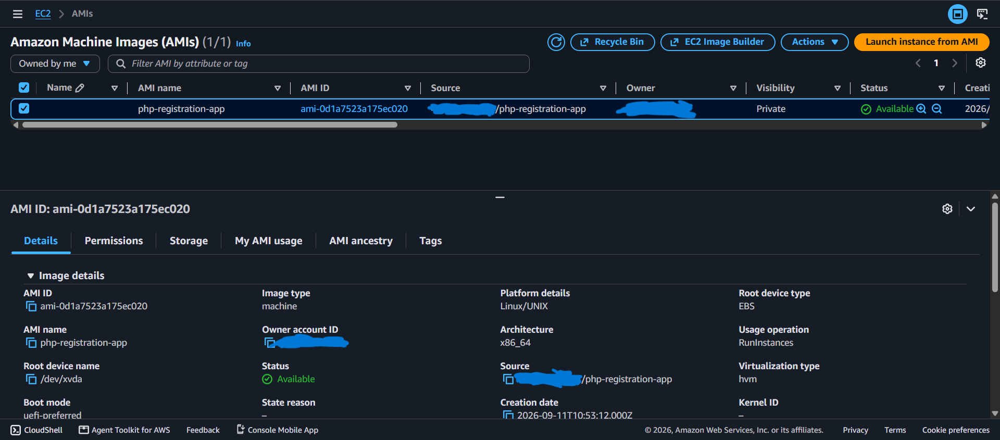
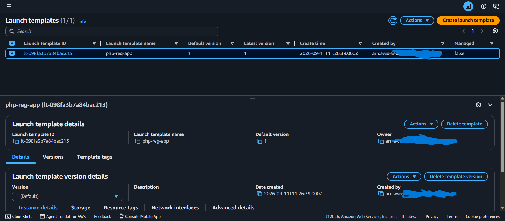
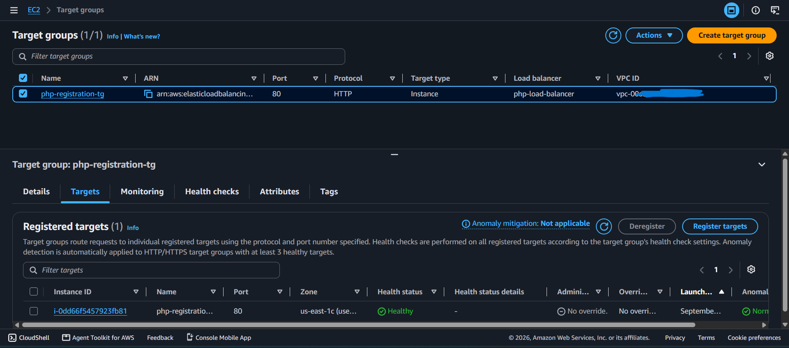
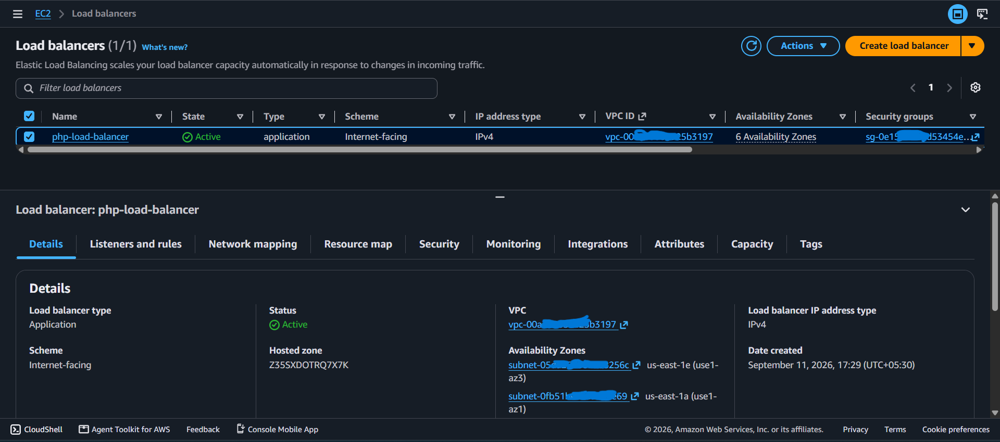
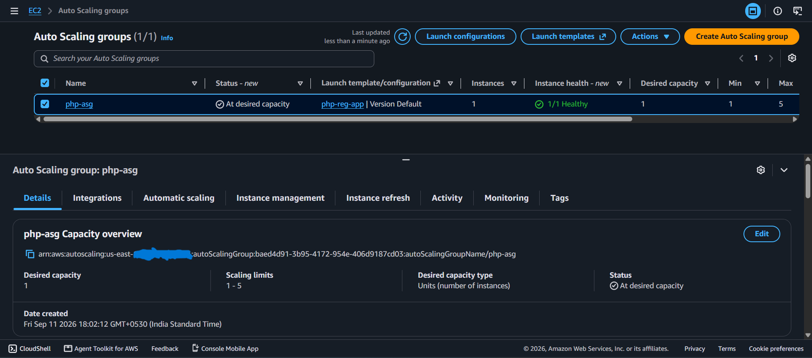

# PHP Registration App

A simple PHP registration application deployed on AWS using **EC2, Apache, Amazon RDS MySQL, AMI, Launch Template, Target Group, Application Load Balancer (ALB), and Auto Scaling Group (ASG)**.

This project demonstrates an end-to-end AWS deployment where the PHP application runs on EC2 instances managed by an Auto Scaling Group, traffic is distributed through an Application Load Balancer, and the application connects to a separate Amazon RDS MySQL database.

---

## 📌 Project Overview

The PHP Registration App allows users to enter registration details through a web form.

The application collects:
- Name
- Email
- Website
- Comment
- Gender

Submitted information is stored in an **Amazon RDS MySQL database**.

### Application Flow

```text
User Browser
     |
     | HTTP Request :81
     v
Application Load Balancer
     |
     v
Target Group :80
     |
     +-------------------+
     |                   |
     v                   v
EC2 Instance #1     EC2 Instance #2
Apache + PHP        Apache + PHP
     |                   |
     +---------+---------+
               |
               v
        Amazon RDS MySQL
               |
               v
        student Database
               |
               v
          users Table
```

---

# 🚀 Features

- User registration form
- PHP-based form processing
- MySQL database integration
- Amazon RDS MySQL database
- Apache web server
- AWS EC2 application hosting
- Amazon Linux server
- Custom EC2 AMI
- EC2 Launch Template
- Target Group and health checks
- Application Load Balancer
- Auto Scaling Group
- CPU-based Auto Scaling
- GitHub-based application deployment
- Linux server administration and troubleshooting

---

# 🛠️ Technologies Used

| Technology / Service | Purpose |
|----------------------|---------|
| PHP | Application logic |
| Apache / httpd | Web Server |
| Amazon Linux | Operating System |
| AWS EC2 | Application server |
| Amazon RDS MySQL | Managed database |
| Amazon Machine Image (AMI) | Reusable EC2 server image |
| Launch Template | EC2 configuration for ASG |
| Target Group | Registers EC2 instances for ALB |
| Application Load Balancer | Distributes incoming traffic |
| Auto Scaling Group | Maintains and scales EC2 instances |
| Security Groups | Network access control |
| Git | Version Control |
| GitHub | Source Code Repository |
| Linux | Server Administration |

---

# 📁 Project Structure

```text
php-registration-app/
│
├── signup.html
├── submit.php
├── screenshots/
│   ├── security-group.png
│   ├── ec2-terminal.png
│   ├── mysql-database.png
│   ├── registration-page.png
│   ├── registration-success.png
│   ├── database-records.png
│   ├── ami.png
│   ├── launch-template.png
│   ├── target-group.png
│   ├── alb.png
│   └── auto-scaling-group.png
│
└── README.md
```

---

# ☁️ AWS Deployment

## Step 1: Launch EC2 Instance

Create an EC2 instance from the AWS Management Console. This initial instance is used to configure and test the application before creating the custom AMI.

### Configuration
- AMI: Amazon Linux
- Instance Type: Suitable low-cost instance
- Key Pair: Required for SSH access
- VPC: Project VPC
- Subnet: Application subnet
- Security Group: SSH and HTTP as required

### Initial Security Group Rules

| Type | Protocol | Port | Purpose |
|------|----------|------|---------|
| SSH | TCP | 22 | EC2 administration |
| HTTP | TCP | 80 | Web application testing |

> In the final architecture, public application traffic is handled by the ALB. EC2 HTTP access should preferably be restricted to the ALB Security Group.

---

## Step 2: Connect to EC2

Connect using SSH:

```bash
ssh -i your-key.pem ec2-user@<EC2-PUBLIC-IP>
```

Example:

```bash
ssh -i my-key.pem ec2-user@3.xx.xx.xx
```

---

## Step 3: Update Amazon Linux

```bash
sudo yum update -y
```

---

## Step 4: Install Required Packages

Install Apache, PHP and Git:

```bash
sudo yum install httpd php git mariadb105-server -y
```

Verify PHP:

```bash
php --version
```

Install the PHP MySQL driver:

```bash
sudo yum install php8.5-mysqlnd.x86_64 -y
```

### Installed Components

```text
Apache / httpd
PHP
PHP-MySQLnd
Git
```

> MariaDB/MySQL does not need to run locally on EC2 in the final architecture because the database is hosted in Amazon RDS.

---

## Step 5: Start Apache

```bash
sudo systemctl start httpd
sudo systemctl status httpd
```

Expected status:

```text
active (running)
```

---

## Step 6: Enable Apache at Boot

```bash
sudo systemctl enable httpd
```

---

## Step 7: Check Server Configuration

Check Apache configuration:

```bash
sudo apachectl configtest
```

Expected:

```text
Syntax OK
```

Check PHP and modules:

```bash
php --version
php -m
```

---

# 📦 Application Deployment

## Step 8: Navigate to Apache Web Root

Apache serves the application from:

```bash
/var/www/html/
```

```bash
cd /var/www/html/
```

---

## Step 9: Clone the GitHub Repository

```bash
sudo git clone https://github.com/devvikrantthakur/php-registration-app.git
```

Check files:

```bash
ls
cd php-registration-app
ls
```

Expected application files include:

```text
signup.html
submit.php
README.md
```

Final application directory:

```text
/var/www/html/php-registration-app/
```

---

# 🗄️ Amazon RDS MySQL Configuration

## Step 10: Create Amazon RDS MySQL Database

Create an Amazon RDS MySQL database from the AWS Management Console.

Configure:
- Engine: MySQL
- DB instance identifier: Your preferred identifier
- Master username: Your chosen username
- Master password: Your chosen password
- VPC: Same project VPC
- Port: 3306

The RDS endpoint will look similar to:

```text
<RDS-ENDPOINT>
```

---

## Step 11: Configure RDS Security Group

Allow MySQL traffic from the EC2 application Security Group.

| Type | Protocol | Port | Source |
|------|----------|------|--------|
| MySQL/Aurora | TCP | 3306 | EC2 Security Group |

Do not expose port 3306 to the entire internet.

---

## Step 12: Connect to RDS from EC2

From EC2:

```bash
mysql -h <RDS-ENDPOINT> -u <USERNAME> -p
```

Enter the RDS password when prompted.

---

## Step 13: Create Database

```sql
CREATE DATABASE student;
SHOW DATABASES;
```

---

## Step 14: Select Database

```sql
USE student;
```

---

## Step 15: Create Users Table

Use the schema expected by the PHP registration application:

```sql
CREATE TABLE users (
    id INT PRIMARY KEY AUTO_INCREMENT,
    name VARCHAR(100),
    email VARCHAR(100),
    website VARCHAR(500),
    comment VARCHAR(500),
    gender VARCHAR(100)
);
```

Check the table:

```sql
SHOW TABLES;
```

---

## Step 16: Check Database Records

```sql
SELECT * FROM users;
```

Initially the table may be empty. After registration, submitted information should appear here.

---

# 🔌 PHP Database Configuration

## Step 17: Configure PHP to Connect to RDS

Open `submit.php`:

```bash
cd /var/www/html/php-registration-app
sudo vim submit.php
```

Configure the connection using the RDS endpoint:

```php
$servername = "<RDS-ENDPOINT>";
$username = "<RDS-USERNAME>";
$password = "<RDS-PASSWORD>";
$dbname = "student";
```

| Parameter | Value |
|-----------|-------|
| Server | RDS Endpoint |
| Username | RDS Username |
| Database | student |
| Password | RDS Password |
| Port | 3306 |

Architecture change:

```text
Old:
EC2 → localhost → MariaDB

New:
EC2 → RDS Endpoint → Amazon RDS MySQL
```

> Never commit real database passwords to GitHub. Use placeholders in public documentation.

---

## Step 18: Restart Apache

```bash
sudo systemctl restart httpd
sudo systemctl status httpd
```

---

# 🧪 Initial EC2 Testing

## Step 19: Test the Application on EC2

Before creating the AMI, verify the complete application on the configured EC2 instance.

Direct test URL:

```text
http://<EC2-PUBLIC-IP>/php-registration-app/signup.html
```

Test:

```text
Registration Page
      |
      ↓
Enter Details
      |
      ↓
Submit
      |
      ↓
submit.php
      |
      ↓
RDS MySQL
      |
      ↓
student.users
```

Optional local test from EC2:

```bash
curl http://localhost/php-registration-app/signup.html
```

### Registration Page


### Successful Registration


### Database Records


---

# 💿 EC2 AMI Creation

## Step 20: Create a Custom AMI

After the application server is configured and tested, create a custom AMI from the EC2 instance.

The AMI captures the configured server environment, including:
- Amazon Linux
- Apache
- PHP
- PHP-MySQLnd
- Application files
- Required server configuration

### AWS Console Flow

```text
EC2
  ↓
Select Configured EC2
  ↓
Actions
  ↓
Image and templates
  ↓
Create image
  ↓
Custom AMI
```

Example name:

```text
php-registration-app-ami
```

### Why AMI is Used

The AMI allows the same configured application server to be launched again without manually installing everything from scratch.



---

# 📋 Launch Template

## Step 21: Create Launch Template

Create an EC2 Launch Template using the custom AMI.

The Launch Template defines how new EC2 instances should be launched.

### Configuration
- Launch Template Name: `php-registration-launch-template`
- AMI: Custom PHP application AMI
- Instance Type: Suitable instance type
- Key Pair: As required for SSH
- Security Group: EC2 application Security Group
- Storage: Required EBS configuration

### AWS Console Flow

```text
EC2
  ↓
Launch Templates
  ↓
Create Launch Template
  ↓
Select Custom AMI
  ↓
Configure Instance Type
  ↓
Configure Security Group
  ↓
Create Launch Template
```

### Why Launch Template is Used

The Auto Scaling Group uses the Launch Template to create new EC2 instances with the same server configuration.



---

# 🎯 Target Group

## Step 22: Create Target Group

Create a Target Group for the Application Load Balancer.

### Configuration
- Target Type: Instances
- Protocol: HTTP
- Port: 80
- VPC: Same application VPC
- Health Check Protocol: HTTP
- Health Check Port: Traffic Port
- Health Check Path:

```text
/php-registration-app/signup.html
```

The Target Group registers EC2 instances and performs health checks.

```text
Application Load Balancer
          ↓
    Target Group :80
          ↓
EC2 #1 / EC2 #2 / EC2 #3
```



---

# ⚖️ Application Load Balancer

## Step 23: Create Application Load Balancer

Create an **Application Load Balancer (ALB)**.

### Configuration
- Load Balancer Type: Application Load Balancer
- Scheme: Internet-facing
- IP Address Type: IPv4
- VPC: Application VPC
- Subnets: Appropriate public subnets
- Security Group: ALB Security Group
- Listener: HTTP
- Listener Port: `81`
- Default Action: Forward to the PHP Target Group

### Listener Flow

```text
HTTP :81
   ↓
Target Group :80
   ↓
Healthy EC2 Instance
```

Final application URL:

```text
http://<ALB-DNS-NAME>:81/php-registration-app/signup.html
```

> The ALB DNS name can be used instead of exposing an individual EC2 public IP for application access.



---

# 📈 Auto Scaling Group

## Step 24: Create Auto Scaling Group

Create an Auto Scaling Group using the Launch Template.

### Configuration
- Auto Scaling Group Name: `php-registration-asg`
- Launch Template: `php-registration-launch-template`
- VPC: Application VPC
- Subnets: Application subnets
- Desired Capacity: `3`
- Minimum Capacity: `1`
- Maximum Capacity: `5`
- Load Balancer: Attach the PHP Target Group

### Capacity

```text
Minimum Capacity = 1
Desired Capacity = 3
Maximum Capacity = 5
```

The ASG maintains the desired number of instances and can scale according to the configured policy.

### Target Tracking Policy

Configure target tracking using average CPU utilization:

```text
Average CPU Utilization = 50%
```

When workload increases, ASG can launch additional instances up to the maximum. When workload decreases, it can reduce instances while respecting the minimum capacity.



---

# 🔄 Target Health and Instance Replacement

The Target Group continuously checks EC2 instance health.

If an instance becomes unhealthy or is removed, it can enter a **draining** state during deregistration.

```text
Healthy
   ↓
Deregistering / Draining
   ↓
Terminated / Removed
```

During draining, the Load Balancer stops sending new requests to the target while existing connections can finish. The Auto Scaling Group can launch a replacement instance when required to maintain capacity.

---

# 🔐 Security Group Architecture

Final traffic flow:

```text
Internet
   |
   | HTTP :81
   v
ALB Security Group
   |
   | HTTP :80
   v
EC2 Security Group
   |
   | MySQL :3306
   v
RDS Security Group
```

### ALB Security Group

| Type | Port | Source |
|------|------|--------|
| HTTP | 81 | Internet / Required Source |

### EC2 Security Group

| Type | Port | Source |
|------|------|--------|
| SSH | 22 | Trusted IP |
| HTTP | 80 | ALB Security Group |

### RDS Security Group

| Type | Port | Source |
|------|------|--------|
| MySQL | 3306 | EC2 Security Group |

> This architecture avoids exposing RDS directly to the internet.


---

# 🌐 Final Application Access

Access the application through the ALB:

```text
http://<ALB-DNS-NAME>:81/php-registration-app/signup.html
```

Example format:

```text
http://my-php-alb-123456789.ap-south-1.elb.amazonaws.com:81/php-registration-app/signup.html
```

---

# 📝 Application Workflow

```text
1. User opens the application URL
             ↓
2. Request reaches ALB on Port 81
             ↓
3. ALB forwards request to Target Group
             ↓
4. Target Group selects a healthy EC2 instance
             ↓
5. Apache receives request on Port 80
             ↓
6. PHP processes the request
             ↓
7. submit.php connects to Amazon RDS MySQL
             ↓
8. Data is inserted into student.users
             ↓
9. Response returns through EC2
             ↓
10. ALB sends response back to User
```

---

# 📊 Project Architecture

```text
                           Internet
                              |
                              | HTTP :81
                              v
                 +---------------------------+
                 | Application Load Balancer |
                 |          Port 81           |
                 +-------------+-------------+
                               |
                               v
                    +--------------------+
                    |    Target Group    |
                    |       HTTP :80     |
                    +---------+----------+
                              |
                +-------------+-------------+
                |             |             |
                v             v             v
          +-----------+ +-----------+ +-----------+
          |  EC2 #1   | |  EC2 #2   | |  EC2 #3   |
          | Apache    | | Apache    | | Apache    |
          | PHP       | | PHP       | | PHP       |
          +-----+-----+ +-----+-----+ +-----+-----+
                |             |             |
                +-------------+-------------+
                              |
                              | MySQL :3306
                              v
                    +-------------------+
                    |   Amazon RDS       |
                    |   MySQL Database   |
                    +---------+---------+
                              |
                              v
                       student Database
                              |
                              v
                         users Table

             Auto Scaling Group
                     |
                     v
       +-----------------------------+
       | Min: 1 | Desired: 3 | Max: 5 |
       +-----------------------------+
                     |
                     v
              Launch Template
                     |
                     v
                 Custom AMI
```

---

# 🔧 Useful Linux Commands

## Apache Status

```bash
sudo systemctl status httpd
```

## Start Apache

```bash
sudo systemctl start httpd
```

## Restart Apache

```bash
sudo systemctl restart httpd
```

## Enable Apache

```bash
sudo systemctl enable httpd
```

## PHP Version

```bash
php --version
```

## PHP Modules

```bash
php -m
```

## Apache Configuration

```bash
sudo apachectl configtest
```

## Apache Error Log

```bash
sudo tail -f /var/log/httpd/error_log
```

## Application Files

```bash
cd /var/www/html/php-registration-app
ls
```

## RDS Connection

```bash
mysql -h <RDS-ENDPOINT> -u <USERNAME> -p
```

## Database Checks

```sql
SHOW DATABASES;
USE student;
SHOW TABLES;
SELECT * FROM users;
```

---

# 🛠️ Troubleshooting

## Apache is not running

```bash
sudo systemctl status httpd
sudo systemctl start httpd
```

## PHP code is not executing

```bash
php --version
php -m
sudo systemctl restart httpd
```

## Database connection error

Verify:
1. RDS is available.
2. RDS endpoint is correct.
3. RDS username and password are correct.
4. Database is `student`.
5. RDS Security Group allows TCP 3306 from the EC2 Security Group.
6. PHP MySQL extension is installed.

Test:

```bash
mysql -h <RDS-ENDPOINT> -u <USERNAME> -p
```

## Target Group shows unhealthy

Check:
1. EC2 is running.
2. Apache is running.
3. Apache is listening on port 80.
4. EC2 Security Group allows HTTP 80 from the ALB Security Group.
5. Health check path is correct.
6. Application exists under `/var/www/html/`.

Health check path:

```text
/php-registration-app/signup.html
```

Test from EC2:

```bash
curl http://localhost/php-registration-app/signup.html
```

## ALB cannot reach EC2

Check:
1. ALB is active.
2. Listener is configured on port 81.
3. Listener forwards to the correct Target Group.
4. Target Group contains healthy targets.
5. EC2 Security Group allows HTTP 80 from the ALB Security Group.
6. Apache is running.

## Application works on one EC2 but not newly created ASG instances

If changes were made manually after creating the AMI, new instances will not automatically contain those changes.

Recommended flow:

```text
Make Changes
     ↓
Test Application
     ↓
Create New AMI
     ↓
Update Launch Template
     ↓
Use Updated Launch Template in ASG
```

---

# 🔐 Security Notes

Do not commit sensitive information to GitHub.

Avoid storing:
- Database passwords
- AWS Access Keys
- Private keys
- `.pem` files
- Secret tokens
- Production credentials

Use placeholders:

```text
<RDS-ENDPOINT>
<RDS-USERNAME>
<RDS-PASSWORD>
<ALB-DNS-NAME>
<EC2-PUBLIC-IP>
```

For production environments:
- Restrict SSH to trusted IP addresses.
- Do not expose RDS port 3306 publicly.
- Allow EC2 HTTP traffic from the ALB Security Group.
- Keep database credentials outside source code.
- Use HTTPS/TLS for production web traffic.

---

# 🎯 Skills Demonstrated

### AWS
- Amazon EC2
- EC2 Security Groups
- Amazon RDS MySQL
- Amazon Machine Image (AMI)
- EC2 Launch Template
- Target Group
- Application Load Balancer
- Auto Scaling Group
- Target Tracking Scaling
- Health Checks
- VPC networking concepts

### Linux / Server Administration
- Amazon Linux
- SSH
- Linux package management
- `yum`
- `systemctl`
- Apache / `httpd`
- Apache configuration
- Linux file system
- Application deployment
- Server troubleshooting
- Apache logs

### Application
- PHP
- PHP-MySQL connectivity
- HTML registration form
- Apache Web Server

### Database
- MySQL
- Amazon RDS
- Database creation
- Table creation
- SQL queries
- Remote database connectivity

### DevOps / Deployment Concepts
- Git
- GitHub
- AMI-based server provisioning
- Launch Template
- Load Balancing
- Auto Scaling
- Health Checks
- Application deployment

---

# 📚 Key AWS Concepts Used

### EC2
Amazon EC2 provides virtual servers used to host the PHP application.

### AMI
An AMI is a reusable image of an EC2 server configuration. The configured application server is used to create a custom AMI so the same setup can be launched again.

### Launch Template
A Launch Template defines the configuration used to launch EC2 instances. The Auto Scaling Group uses it to create instances.

### Target Group
The Target Group contains EC2 instances that can receive traffic from the ALB and performs health checks.

### Application Load Balancer
The ALB receives incoming web traffic and distributes requests to healthy EC2 instances.

```text
ALB Listener :81
       ↓
Target Group :80
       ↓
EC2 Instances
```

### Auto Scaling Group
The ASG manages EC2 application instances.

```text
Minimum = 1
Desired = 3
Maximum = 5
```

### Amazon RDS MySQL
RDS provides the managed MySQL database.

```text
EC2
 |
 | TCP 3306
 ↓
RDS MySQL
```

### Security Group
Security Groups control network access:

```text
Internet
   ↓
ALB SG :81
   ↓
EC2 SG :80
   ↓
RDS SG :3306
```

---

# 🔄 Deployment Summary

```text
GitHub Repository
       ↓
Launch Initial EC2
       ↓
Configure Security Group
       ↓
Connect Using SSH
       ↓
Update Amazon Linux
       ↓
Install Apache + PHP + Git
       ↓
Start & Enable Apache
       ↓
Clone GitHub Repository
       ↓
Deploy Application under /var/www/html/
       ↓
Create Amazon RDS MySQL
       ↓
Configure RDS Security Group
       ↓
Connect EC2 to RDS
       ↓
Create student Database
       ↓
Create users Table
       ↓
Configure submit.php with RDS Endpoint
       ↓
Test Application
       ↓
Create Custom AMI
       ↓
Create Launch Template
       ↓
Create Target Group
       ↓
Create Application Load Balancer
       ↓
Configure ALB Listener :81
       ↓
Create Auto Scaling Group
       ↓
Desired Capacity = 3
       ↓
Configure Target Tracking
       ↓
Verify Target Health
       ↓
Access Application through ALB
       ↓
http://ALB-DNS-NAME:81/php-registration-app/signup.html
```

---

# 🔗 GitHub Repository

[PHP Registration App - GitHub](https://github.com/devvikrantthakur/php-registration-app)

---

# 👨‍💻 Author

**Vikrant Thakur**

[GitHub Profile](https://github.com/devvikrantthakur)
